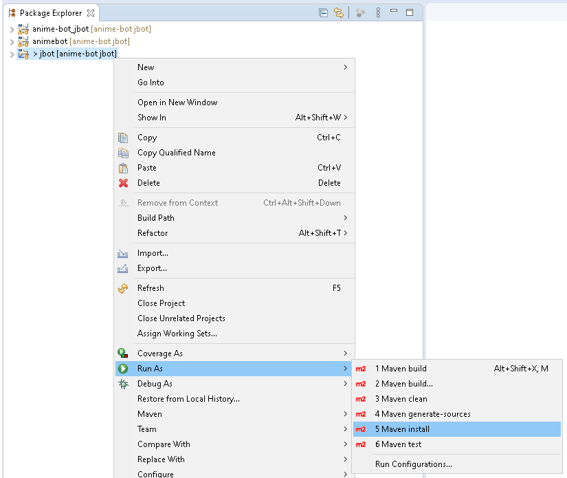
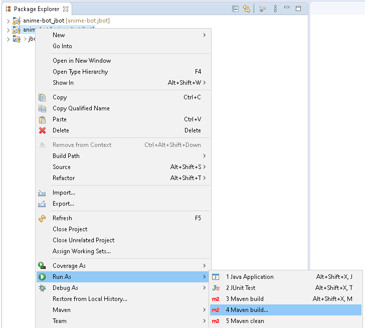
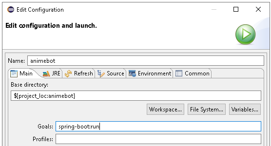

---
# MCIT 591 Final Project
__Team 29 - Slack Anime Bot__

Bringing joy to Otaku everywhere since 2020

---
## Introduction
Who, what, where, and why (see Technical Specifications below for how)
### Who is Team 29
Team 29 is a group of three intelligent, enthusiastic students who are taking MCIT 591 during Spring 2020 at the prestigious University of Pennsylvania

[Andrea Mackie](https://github.com/andreamackie13)

[Brian Chan](https://github.com/chan-b)

[Gulcin Ennis](https://github.com/G-Ennis)

### Why Anime
During the Coronavirus Lockdown of 2020, there's no more relaxing way to pass the time than to watch Anime and read Manga

Yes, we do Manga too!

---
## Quick-Start Guide
Here in case you need it
### Software Prerequisites
* Eclipse
* JRE Library
* JUnit Library
* M2Eclipse
* Git

### Getting Started
Follow these instructions to quickly get the animebot up and running:
1. Clone this project: `git clone https://github.com/UPenn-CIT599/final-project-team29_animebot.git anime-bot`
2. Open the anime-bot project in Eclipse. It should import three projects: the parent (jbot) and two nested modules (anime-bot_jbot and animbebot)
3. Right-click the jbot project and select Run As > Maven install

Maven install

4. Right-click on the animebot project module and select Run As > Maven build...

Maven build

5. Under Goals, enter 'spring-boot:run' and click Run

Maven configuration

6. Login to the Slack Workspace: https://591finalproject.slack.com

Slack Workspace Credentials

__Username:__ mcit591.team29@gmail.com
__Password:__ mcit591!

7. Navigate to the bot channel
8. You're now ready to talk with our animebot!

---
## How to Interact
Now that the Slack Anime Bot is up and running, try talking to it!
### Available Commands
Below is a list of commands you can use to interact with our animebot:
* @animebot
* get manga
* get top anime
* get top manga
* anime search
* manga search

---
## Technical Specifications
How this all works.
### Overview
Our Slack Anime Bot is based on the [JBot Framework](https://github.com/rampatra/jbot)

The JBot Framework code is contained in the jbot project folder. Team 29 is responsible for all code in the animebot module

We leverage the [Jikan API](https://jikan.moe/) to fetch information from MyAnimeList.net

---
## Known Issues
Unfortunately, things don't always go according to plan. Fortunately, we know what to do
### Installation

I don't see three projects when I open the local repository in Eclipse

Try deleting the local repository and re-cloning it from GitHub

Maven install or Maven build fails when compiling the JUnit tests

You may need to remove and re-add the JUnit Library to the animebot project Build Path for the code to compile

